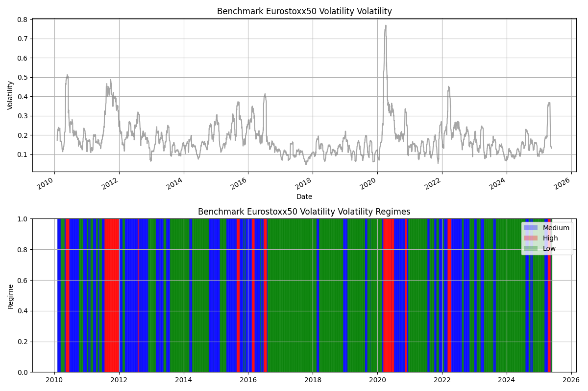
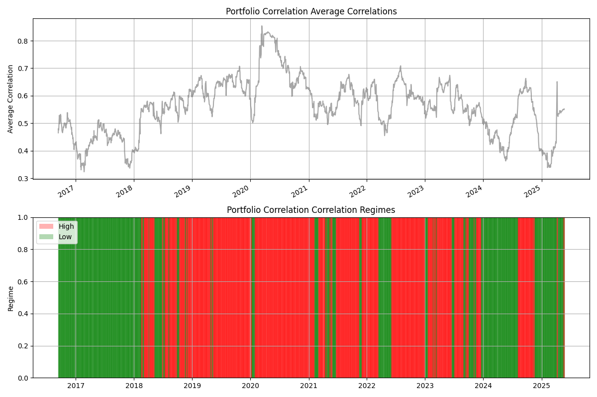

  # **Regime Detection Project for European Assets**  

  ---

  ### **Overview**
  
  This notebook implements a regime detection algorithm for a portfolio of European assets using data-driven techniques to identify distinct market environments.
  - **Market Regimes (HMM):** Bull, Bear, Sideways
  - **Volatility Regimes (K-means):** Low, Medium, High
  - **Correlation Regimes (K-means):** Low, High
  

  ---

  ### **Project Structure**
  ```bash
  regime_detection_project/
  ├── data/
  │   ├── raw/           # Raw data (dummy or downloaded)
  │   └── processed/     # Cleaned price and return data
  ├── results/
  │   ├── figures/       # Generated plots and regime visualizations
  │   └── tables/        # Summary statistics and regime tables
  ├── src/
  │   ├── collect_data.py     # Download or load raw data
  │   ├── process_data.py     # Clean and compute returns
  │   └── regime_detection.py # HMM and clustering implementation
  ├── regime_analysis.ipynb    # Notebook walkthrough of the analysis
  └── README.md                # Project description and instructions
  ```

  ---

  ## Interactive Analysis

  ---

  ### 1. Introduction
  
  In this section, we define market, volatility, and correlation regimes and discuss their relevance for portfolio management.

  - Market regimes capture return behaviors (Bull vs Bear vs Sideways).
  - Volatility regimes classify periods of calm versus turbulence.
  - Correlation regimes highlight asset co-movement patterns.
  

  ---

  ### 2. Data Processing
  ```python
  # Load processed asset prices and compute log returns
  df_prices = pd.read_csv('data/processed/prices.csv', index_col=0, parse_dates=True)
  df_returns = np.log(df_prices / df_prices.shift(1)).dropna()

  df_returns.describe()
  ```

  ---

  ### 3. Regime Detection
  
  - **Market Regimes (HMM):** Fit HMM to multivariate returns
  - **Volatility Regimes (K-means):** Cluster rolling volatilities
  - **Correlation Regimes (K-means):** Cluster rolling correlation matrices
  

  ---

  ### 4. Visualizing Results
  ```python
  # Display saved regime plots
  from IPython.display import Image, display
  for fname in ['market_regimes.png', 'volatility_regimes.png', 'correlation_regimes.png']:
      display(Image(filename=f'results/figures/{fname}'))
  ```


  **Figure Placeholders**  


  - **Market Regimes**  
    
    
    

  - **Volatility Regimes**  
    
    
    

  - **Correlation Regimes**  
    
    
    

  ---

  ### 5. Conclusion
  ```markdown
  The combined framework provides insights into changing market environments. Adapt this pipeline to other assets or extend with additional methods.
  ```

  ---

  ## Outputs & Artifacts
  ```markdown
  - **Processed Data:** data/processed/*.csv
  - **Models & Tables:** results/tables/*.csv
  - **Figures:** results/figures/*.png
  ```

  ---

  ## Known Issues & Limitations
 
  - `collect_data.py` uses dummy data for some European tickers; update data source as needed.
  - The clustering results and subsequent regime classifications are highly dependent on both the characteristics of the input data (e.g., time span, asset universe, sampling frequency) and the choice of the number of clusters k, which directly defines the number of regimes. An inappropriate k can lead to overfitting (too many regimes capturing noise) or oversmoothing (too few regimes obscuring meaningful dynamics).
  - Regime identification via unsupervised methods involves a trade-off between model complexity and interpretability; careful validation (e.g., silhouette analysis, cross-validation of clustering stability, or information criteria) is required to select appropriate hyperparameters.
  - Results are illustrative; for robust inference, calibrate hyperparameters, perform sensitivity analysis across different k values, and validate on extended or out-of-sample data.
  
